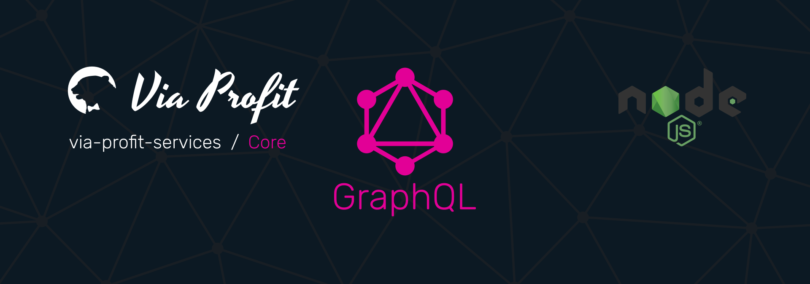

# Via Profit services / Core



> Via Profit services / **Core** - это основной пакет `via-profit-services` предоставляющий [GraphQL](https://graphql.org/)-сервер и сервер аутентификации. Пакет осуществляет обвязку между всеми имеющимися модулями данной системы и реализует собой приложение.

## Содержание

- [Зависимости](#dependency)
- [Установка и настройка](#setup)
- [Как использовать](#how-to-use)
- [GraphQL скалярные типы](#graphql-scalar)
- [Аутентификация](#authentication)
- [Параметры инициализации](#options)
- [Express Middleware](#express-middleware)
- [Конвенция](#convention)
  - [Конвенция. Сервер](#convention-server)
  - [Конвенция. Базы данных](#convention-databases)
  - [Конвенция. Dataloader](#convention-dataloader)
- [Контекст](#context)
- [Логгер](#logger)
- [Dataloader](#dataloader)
- [Cron](#cron)
- [Типы и интерфейсы](#types)
- [Error handlers (исключения)](#error-handlers)
- [CLI](#cli)
- [Contributing](./CONTRIBUTING.md)


## <a name="dependency"></a> Зависимости

1. [Redis](https://redis.io/)

Пакет использует [graphql-redis-subscriptions](https://github.com/davidyaha/graphql-redis-subscriptions). Соответственно, необходим Redis сервер, который может быть установлен локально, либо находиться на удаленном хосте.

Помимо `graphql-redis-subscriptions`, Redis используется в качестве системы хранения так называемого `blackList` токенов, который были отозваны


## <a name="setup"></a> Установка и настройка

### Установка

```bash
yarn add ssh://git@gitlab.com:via-profit-services/core.git#semver:^0.22.3
```

Список версий см. [здесь](https://gitlab.com/via-profit-services/core/-/tags/)

### Настройка сертификатов

**Замечание:** Чтобы запустить localhost на SSL используйте [mkcert](https://github.com/FiloSottile/mkcert)

Для работы [JWT](https://github.com/auth0/node-jsonwebtoken) необходимо сгенерировать SSH-ключи используя алгоритм, например, `RS256`.

**Замечание:** При запросе `passphrase` просто нажмите _Enter_ для того, чтобы этот параметр остался пустым. То же самое необходимо сделать при подтверждении `passphrase`.

В корне проекта (на том же уровне, что и `package.json`) создайте директорию `keys` и создайте в ней ключи выполнив команды:

```bash
ssh-keygen -t rsa -b 4096 -m PEM -f jwtRS256.key
openssl rsa -in jwtRS256.key -pubout -outform PEM -out jwtRS256.key.pub
```

После выполнения команд будут создан приватный ключ(`jwtRS256.key`) и публичный ключ (`jwtRS256.key.pub`)


### Настройка параметров

Для хранения реквизитов доступа и прочих настроек, зависящих от устройства, на котором разрабатывается и запускается проект, используется [DotEnv](https://github.com/motdotla/dotenv).

В корне проекта (на том же уровне, что и `package.json`) создайте файл `.env` со следующим содержимым:
**Замечание:**: _Ниже представлен фрагмент минимальных настроек для полноценной работы сервера_

```dosini
PORT=4000

LOG=./misc/log

GQL_ENDPOINT=/graphql
GQL_SUBSCRIPTIONENDPOINT=/subscriptions

DB_HOST= <-- Хост базы данных
DB_USER= <-- Имя пользователя базы данных
DB_NAME= <-- Название базы данных
DB_PASSWORD= <-- Пароль базы данных
DB_TIMEZONE=UTC
DB_MIGRATIONS_DIRECTORY= <-- Путь до директории файлов миграций Knex (должна быть внутри src)
DB_MIGRATIONS_TABLENAME=knex_migrations
DB_MIGRATIONS_EXTENSION=ts
DB_SEEDS_DIRECTORY= <-- Путь до директории сид файлов Knex (должна быть внутри src)
DB_SEEDS_EXTENSION=ts

REDIS_HOST=localhost
REDIS_PORT=6379
REDIS_PASSWORD=

JWT_ALGORITHM=RS256
JWT_ACCESSTOKENEXPIRESIN=900
JWT_REFRESHTOKENEXPIRESIN=2.592e6
JWT_ISSUER=viaprofit-services
JWT_PRIVATEKEY=./misc/keys/jwtRS256.key
JWT_PUBLICKEY=./misc/keys/jwtRS256.key.pub

SSL_KEY=/home/me/.local/share/mkcert/localhost-key.pem
SSL_CERT=/home/me/.local/share/mkcert/localhost.pem

TIMEZONE=UTC

COOKIES_SIGN_SECRET= <-- Секрет для подписи Cookies
```

**Замечание:** Старайтесь не использовать `process.cwd()` там, где это пересекается с `knex`, т.к. knex переопределяет рабочию директорию в некоторых случаях, например, при использовании миграций ([issue #2952](https://github.com/knex/knex/issues/2952))


### Миграции

После первой установки примените все необходимые миграции:
```bash
yarn knex:migrate:latest
```

После применения миграций будет доступен один аккаунт `Developer`. Для входа в учетную запись используйте логин и пароль - `dev`. Аккаунт Developer имеет следующие роли: `["admin", "developer"]`


## <a name="how-to-use"></a> Как использовать

### Сервер

Для создания сервера необходимо сконфигурировать [логгер](#logger), создать инстанс приложения и запустить `bootstrap` метод.

1. Создайте схему
   **Замечание:** Так как тип данных `Query` может существовать, объявленный в другом модуле, следует декларировать его с ключевым словом `extend`. Это же условие справедлимо и для мутаций

```graphql
extend type Query {
  myModule: MyModuleQuery!
}

extend type Mutation {
  myModule: MyModuleMutation!
}

extend type Subscription {
  somethingChanes: String!
}

type MyModuleQuery {
  version: String!
}

type MyModuleMutation {
  updateAnything(input: String!): Boolean!
}
```

2. Создайте резолвер

```ts
import { IContext } from '@via-profit-services/core';
import { IResolverObject } from 'graphql-tools';

const resolvers: IResolverObject<any, IContext> = {
  Query: {
    myModule: () => ({}),
  },
   Mutation: {
    myModule: () => ({}),
  },
  MyModuleQuery: {
    version: (parent, args, context) => {
      return 'v.0.1.1';
    },
  },
  Subscription: {
    somethingChanes: {
      subscribe: (parent, args, context) => {
        return context.pubsub.asyncIterator('triggerName');
      },
    },
  },
  MyModuleMutation: {
    updateAnything: (parent, args, context) => {
      const { input } = args;
      const { pubsub } = context;

      pubsub.publish('trigger', {
        updateAnything: 'payload data string',
      });
    },
  },
 
};

export default resolvers;
```

3. Создайте инстанс приложения

```ts
import { App, configureLogger } from '@via-profit-services/core';
import typeDefs from './my-typedefs';
import resolver from './my-resolver';
import fs from 'fs';

// Конфигурируем логгер
const logger = configureLogger({
  logDir: path.resolve(__dirname, './log'), // Необходимо передать относительный путь от корня проекта
});

// Создание объекта приложения
const app = new App({
  typeDefs: [ typeDefs ],
  resolvers: [ resolver ],
  logger,
  jwt: { ... },
  database: { ... },
  serverOptions: {
    key: fs.readFileSync('/path/to/cert-key.pem'),
    cert: fs.readFileSync('/path/to/cert.pem'),
  },
  ...
});

// Запуск сервера
app.bootstrap();

```

### `buildQueryFilter`

_Преобразует входные данные от GraphQL_

Принимает объект входных фильтров согласно спецификации GraphQL и возвращает объект, готовый для передачи в любой сервис для выборки списка каких-либо данных, например:

```ts
import {
  IContext,
  buildQueryFilter,
  IDirectionRange,
  TInputFilter,
} from '@via-profit-services/core';
import { IResolverObject } from 'graphql-tools';
import MyService from './my-service';

export const MyQueries: IResolverObject<any, IContext, TInputFilter> = {
  list: async (obj, args, context) => {
    // аргумент args = { first, last, after, before, orderBy }

    // Преобразование входных данных в фильтр для модели сервиса
    const queryFilter = buildQueryFilter(args);

    // Инициализация какого-либо сервиса
    const service = new MyService({ context });

    // Вызов метода сервиса, который принимает преобразованный фильтр
    // Метод сервиса должен возвращать объект типа <IListResponse>:
    /*
      interface IListResponse<T> {
        totalCount: number; // <-- общее количество элементов
        offset: number; // <-- Текущий сдвиг выборки (PostgreSQL offset)
        limit: number; // <-- Текущее ограничение выборки (PostgreSQL limit)
        nodes: Node<T>[]; // <-- массив объектов, содержащих ключ cursor типа number
        orderBy: TOrderBy; // <-- Текущее значение группировки выборки (PostgreSQL group by)
        where: TWhere; // <-- Текущее значение ограничения выборки (PostgreSQL where)
      }
    */

    const myConnection = await service.getListOfMyData(queryFilter);

    // Преобразовываем полученные данные в GraphQL Cursor Connections (см. след пример)
    return buildCursorConnection(myConnection, 'cursorName');
  },
};
```

### `buildCursorConnection`

_Формирует [GraphQL Cursor Connections](https://facebook.github.io/relay/graphql/connections.htm)_

Принимает в качестве первого аргумента объект типа `<IListResponse>`, а в качестве второго - строку для именования курсора и возвращает объект типа `<ICursorConnectionProps>`, который соответствует возвращаемому значению [GraphQL Cursor Connections](https://facebook.github.io/relay/graphql/connections.htm) (см. предыдущий пример):

### `stringToCursor`

_Преобразует строку в курсор_

Принимает в качестве единственного аргумента строку и возвращает `base64` закодированную строку. Применяется для кодирования курсоров.

### `cursorToString`

_Преобразует курсор в строку_

Принимает в качестве единственного аргумента `base64` строку, и возвращает ее декодированное значение. Применяется для декодирования курсоров.


### `convertOrderByToKnex`

_Конвертирует массив типа `<TOrderBy>` в массив `<TOrderByKnex>`_

Принимает в качестве единственного аргумента массив формата `Array<{field: string; direction: IDirectionRange;}>` и преобразует его в массив формата `Array<{column: string; order: IDirectionRange;}>`:

```ts
knex('table')
  .select('*')
  .orderBy(convertOrderByToKnex(orderBy));
```

### `convertJsonToKnex`

_Конвертирует переданный массив или объект в `Knex.Raw()` запрос подставляя модификатор `::jsonb`_

Принимает в качестве первого аргумента инстанс knex, в качестве второго - массив или объект. Возвращает `Knex.Raw<TRecord>`
Данный метод используется для подстановки SQL выражения, например, в блок `insert`:

```ts
knex('table').insert({
  name: 'Anny',
  jsonbData: convertJsonToKnex(knex, [{ foo: 'bar' }]),
});
```


### `collateForDataloader`

_Преобразует выборку для даталоадера для случаев, когда извлекаемое значение отсутствует, но было запрошено даталоадером_

Принимает в качестве первого аргумента массив ID, а в качестве второго - результат выборки для лоадера и возвращает данные в соответствии с набором данных лоадера, либо `null`, если запрашиваемые данные не найдены.

Наличие трерьего аргумента определяет, что вместо `null`, если запрашиваемые данные не найдены, будет возвращен `undefined`


### `arrayOfIdsToArrayOfObjectIds`

_Преобразует массив с ID в массив объектов, сеодержащих единственный ключ `id` с соответствующим значением_

Принимает в качестве единственного аргумента массив и возвращает массив объектов, либо `null`, если массив пустой

### `extractNodeIds`

_Извлекает из массива типа `<Node>` ID и возвращает в виде массива_

Принимает в качестве единственного аргумента массив элементов и возвращает массив их ID

### `extractNodeField`

_Извлекает из массива типа `<Node>` ключи и возвращает в виде массива_

Принимает в качестве первого аргумента массив элементов, а в качестве второго - ключ, массив которых необходимо возвратить

## <a name="graphql-scalar"></a> GraphQL скалярные типы

Via Profit сервер включает в себя схему, содержащую некоторые скаляры GraphQL.

scalar **Money**
_Тип представления денежных значений. Значение(сумма) хранится в наименьшей денежной единице (в копейках, в центах и т.п.). Т.о. Сумма в 250 USD будет храниться как 250000 (250$ * 100¢)_

scalar **DateTime**
_Тип представления стандартного объекта Date. Может быть представлена как просто дата, так и дата и время, но не время_

scalar **Date**
_Тип представления даты без времени (ГГГГ:ММ:ДД)_

scalar **Time**
_Тип представления времении (HH:mm:ss или HH:mm). Может быть представлен как с секундами, так и без них. Секунды будут автоматически добавлены к результату, в случае их отсутствия_

scalar **URL**
_Тип представления URL-адреса согласно стандарту [RFC3986](https://www.ietf.org/rfc/rfc3986.txt)_

scalar **EmailAddress**
_Тип представления Email-адреса согласно стандарту [RFC822](https://www.w3.org/Protocols/rfc822/)_

scalar **JSON**
_Тип представления JSON в виде строки, содержащей JSON-объект или объекта согласно стандарту [ECMA-404](http://www.ecma-international.org/publications/files/ECMA-ST/ECMA-404.pdf)_

scalar **JSONObject**
_Тип представления JSON в виде объекта согласно стандарту [ECMA-404](http://www.ecma-international.org/publications/files/ECMA-ST/ECMA-404.pdf)_


## <a name="authentication"></a> Аутентификация

Аутентификация реализована средствами GraphQL. Namespace схемы - `auth`


### Payload токена

Каждый токен содержит `payload` данные:

**Payload для Access токена**

| Параметр     | Значение                                                                                                                          |
| ------------ | --------------------------------------------------------------------------------------------------------------------------------- |
| `type`       | Тип токена. Может иметь значение `access` для Access токена и `refresh` для Refresh токена                                        |
| `id`         | ID токена                                                                                                                         |
| `uuid`       | ID аккаунта, для которого выдан токен                                                                                             |
| `roles`      | Массив ролей аккаунта                                                                                                             |
| `exp`        | время в формате Unix Time, определяющее момент, когда токен станет не валидным (expiration)                                       |
| `iss`        | чувствительная к регистру строка или URI, которая является уникальным идентификатором стороны, генерирующей токен (issuer)        |
| `associated` | Параметр содержится только в payload у Refresh токена и определяет ID Access токена, с которым он (Refresh токен) является парным |

Пример `payload` для Access токена

```json
{
  "type": "access",
  "id": "b485d679-facc-4afe-b6a0-f17ab387db9b",
  "uuid": "97878833-61ea-41f0-aeae-ec9d4b887447",
  "roles": ["manager", "writer"],
  "exp": 1584939413,
  "iss": "viaprofit-services"
}
```


## <a name="options"></a> Параметры инициализации

Параметры определяются интерфейсом <IInitProps>.

Список поддерживаемых опций:

| Параметр                        | Тип                         | Обязательный | Описание                                                                                                                                                                         |
| :------------------------------ | :-------------------------- | :----------: | :------------------------------------------------------------------------------------------------------------------------------------------------------------------------------- |
| `port`                          | `number`                    |              | Номер порта на котором должен запуститься сервер, по умолчанию - `4000`                                                                                                          |
| `endpoint`                      | `string`                    |              | endpoint graphql сервера, по умолчанию - `/graphql`                                                                                                                              |
| `subscriptionEndpoint`          | `string`                    |              | endpoint graphql сервера subscriptions, по умолчанию - `/subscriptions`                                                                                                          |
| `timezone`                      | `string`                    |              | Временная зона сервера. `timestamp` значения из базы данных бедет преобразованы в соответствующее часовому поясу время Значение будет добавлено в контекст. По умолчанию - `UTC` |
| `database`                      | `Knex.Config`               |      Да      | Объект параметров для работы с базой данных. Соответствует типу `Knex.Config`, но                                                                                                |
| `database.connection`           | `Knex.PgConnectionConfig`   |      Да      | Объект подключения к базе данных. Соответствует конфигурации `Postgresql` (см `Knex.PgConnectionConfig`)                                                                         |
| `database.connection.database`  | `string`                    |      Да      | Название базы данных                                                                                                                                                             |
| `database.connection.host`      | `string`                    |      Да      | Хост базы данных                                                                                                                                                                 |
| `database.connection.user`      | `string`                    |      Да      | Имя пользователя базы данных                                                                                                                                                     |
| `database.connection.password`  | `string`                    |      Да      | Пароль подключения к базе данных                                                                                                                                                 |
| `database.timezone`             | `string`                    |      Да      | Временная зона базы данных. Данное значение будет передано в запросе `SET TIMEZONE = ...` при установлении подключения к базе                                                    |
| `database.migrations`           | `Knex.MigratorConfig`       |      Да      | Объект настроек миграций                                                                                                                                                         |
| `database.migrations.directory` | `string`                    |      Да      | Путь до директории с миграциями                                                                                                                                                  |
| `database.migrations.tableName` | `string`                    |      Да      | Название служебной таблицы миграций Knex                                                                                                                                         |
| `database.migrations.extension` | `enum`                      |      Да      | Расширение файлов миграций (`ts` или `js`)                                                                                                                                       |
| `database.seeds`                | `Knex.SeedsConfig`          |      Да      | Объект настроек сидов                                                                                                                                                            |
| `database.seeds.directory`      | `string`                    |      Да      | Путь до директории с сидами                                                                                                                                                      |
| `database.seeds.extension`      | `enum`                      |      Да      | Расширение файлов сидов (`ts` или `js`)                                                                                                                                          |
| `jwt`                           | `IJwtConfig`                |      Да      | Объект настроек [jsonwebtoken](https://github.com/auth0/node-jsonwebtoken). Значение будет добавлено в контекст                                                                  |
| `jwt.accessTokenExpiresIn`      | `number`                    |      Да      | Время в формате Unix Time, определяющее момент, когда токен станет не валидным (время жизни Access токена в секундах)                                                            |
| `jwt.algorithm`                 | `enum`                      |      Да      | Алгоритм подписи JWT                                                                                                                                                             |
| `jwt.issuer`                    | `string`                    |      Да      | Чувствительная к регистру строка или URI, которая является уникальным идентификатором стороны, генерирующей токен                                                                |
| `jwt.privateKey`                | `string`                    |      Да      | Путь до файла приватного ключа                                                                                                                                                   |
| `jwt.publicKey`                 | `string`                    |      Да      | Путь до файла с публичным ключом                                                                                                                                                 |
| `jwt.refreshTokenExpiresIn`     | `number`                    |      Да      | Время в формате Unix Time, определяющее момент, когда токен станет не валидным (время жизни Refresh токена в секундах)                                                           |
| `logger`                        | `ILoggerConfig`             |      Да      | Объект настроек логгера                                                                                                                                                          |
| `logger.logDir`                 | `string`                    |      Да      | Путь расположения директории логов                                                                                                                                               |
| `logger.logDir.loggers`         | `{ [key: string]: Logger }` |      Да      | Объект произвольных логгеров, которые будут доступны в контексте                                                                                                                 |
| `typeDefs`                      | `ITypedef[]`                |           | Массив GraphQL типов (SDL - схемы)                                                                                                                                               |
| `resolvers`                     | `IResolvers[]`              |           | Массив GraphQL резолверов                                                                                                                                                        |
| `middlewares`                   | `IMiddlewareGenerator[]`    |           | Массив GraphQL middleware                                                                                      |
| `serverOptions`                 | `https.ServerOptions`       |      Да      | Объект настроек `https` сервера                                                                                                                                                  |
| `serverOptions.key`             | `string`                    |            | Путь до файла приватного ключа сертификата домена (SSL)                                                                                                                          |
| `serverOptions.cert`            | `string`                    |            | Путь до файла сертификата домена (SSL)                                                                                                                                           |
| `serverOptions.cookieSign`      | `string`                    |      Да      | Секретный ключ для подписи Cookies                                                                                                                                               |
| `routes`                        | `object`                    |              | Объект URL адресов                                                                                                                                                               |
| `routes.auth`                   | `string`                    |              | URL путь (без схемы и протокола) нахождения сервера аутентификации, по умолчанию - `/auth`                                                                                       |
| `routes.playground`             | `string`                    |              | URL путь (без схемы и протокола) нахождения Graphiql playground, по умолчанию - `/playground`                                                                                    |
| `routes.voyager`                | `string`                    |              | URL путь (без схемы и протокола) нахождения Graphiql voyager, по умолчанию - `/voyager`                                                                                          |
| `enableIntrospection`                 | `boolean`                   |              | Разрешить доступ к Introspection (Всегда разрешено в `development` режиме)                                                                                                             |
| `usePlayground`                 | `boolean`                   |              | Включить Graphiql Playground (Всегда включен в `development` режиме)                                                                                                             |
| `useVoyager`                    | `boolean`                   |              | Включить GraphQL Voyager (Всегда включен в `development` режиме)                                                                                                                 |
| `redis`                    | `object`                   |              | Параметры пакета [ioredis](https://github.com/luin/ioredis/))                                                                                                                 |
| `staticOptions`                    | `object`                   |              | Параметры предоставления статических файлов (подробнее см. [Express Static](https://expressjs.com/ru/starter/static-files.html)))                                                                                                                 |
| `staticOptions.prefix`                    | `string`                   |              | Виртуальный префикс директории статических файлов)                                                                                                                 |
| `staticOptions.staticDir`                    | `string`                   |              | Путь до директории статических файлов                                                                                                                 |
| `expressMiddlewares`                    | `array`                   |              | Массив, содержащий функции вызова [Express middleware](https://expressjs.com/ru/guide/using-middleware.html) (подробнее [здесь](#express-middleware))                                                                                                               |

## <a name="express-middleware"></a> Express Middleware

для подключения `middleware` необходимо создать функцию, на вход которой будет передан объект с контекстом (`IContext`). Функция должна возвращать [Express middleware](https://expressjs.com/ru/guide/using-middleware.html).

Пример подключения `middleware`:

```ts
import { Router } from 'express';
import { IExpressMidlewareContainer, App } from '@via-profit-services/core';

// Simple middleware logger
const loggerMiddleware: IExpressMidlewareContainer = ({ context }) => {
  return (res, req, next) => {
    const { logger } = context;
    logger.server.debug('Some message');

    next();
  }
}

// Router middlwware
const routerMiddleware: IExpressMidlewareContainer = () => {
  const router = Router();
  router.use('/custom-url-path', (req, res, next) => {
    res.json({ response: 'ok' });
  });
  return router;
}

const app = new App({
  ...
  expressMiddlewares: [ customMiddleware, routerMiddleware ],
});
```

## <a name="convention"></a> Конвенция

- [Конвенция. Сервер](#convention-server)
- [Конвенция. Базы данных](#convention-databases)
- [Конвенция. Dataloader](#convention-dataloader)

### <a name="convention-server"></a> Конвенция. Сервер

1.  Временная зона сервера должна совпадать с временной зоной сервера базы данных, для этого рекомендуется все операции над датами производить в [UTC](https://ru.wikipedia.org/wiki/%D0%92%D1%81%D0%B5%D0%BC%D0%B8%D1%80%D0%BD%D0%BE%D0%B5_%D0%BA%D0%BE%D0%BE%D1%80%D0%B4%D0%B8%D0%BD%D0%B8%D1%80%D0%BE%D0%B2%D0%B0%D0%BD%D0%BD%D0%BE%D0%B5_%D0%B2%D1%80%D0%B5%D0%BC%D1%8F)
2.  Сервер должен быть запущен только с [SSL](https://ru.wikipedia.org/wiki/SSL). Чтобы поднять SSL на `localhost` можно использовать [mkcert](https://github.com/FiloSottile/mkcert)

### <a name="convention-databases"></a> Конвенция. Базы данных

1. Все даты, которые содержат время (например, 2020-01-01 12:05:00), должны храниться с типом `timestamptz`
2. Все сущности времени, (например, 12:05:00), должны храниться с типом `timetz`
3. Все даты должны храниться в часовом поясе [UTC](https://ru.wikipedia.org/wiki/%D0%92%D1%81%D0%B5%D0%BC%D0%B8%D1%80%D0%BD%D0%BE%D0%B5_%D0%BA%D0%BE%D0%BE%D1%80%D0%B4%D0%B8%D0%BD%D0%B8%D1%80%D0%BE%D0%B2%D0%B0%D0%BD%D0%BD%D0%BE%D0%B5_%D0%B2%D1%80%D0%B5%D0%BC%D1%8F)
4. Всё время, которое отдельно хранится от даты, должно храниться в часовом поясе **UTC**, за исключением случаев, когда время не зависит от часового пояса
5. Каждая сущность, являющаяся элементом выборки, должна иметь колонки:
   - `createdAt` тип `timestamptz` - Для хранения даты создания записи
   - `updatedAt` тип `timestamptz` - Для хранения даты обновления записи
6. Формат представления валюты должен быть `bigint` или `numeric`. Денежные значения необходимо хранить в наименьшей денежной единице (в копейках, в центах и т.п.). Не использовать тип `money`, т.к. он чувствителен к локали и требует преобразования, которое может быть выполнено через `float`, что может привести к неверному округлению.

### <a name="convention-dataloader"></a> Конвенция. Dataloader

Для кэширования и предотвращения многократной загрузки одних и тех же данных используется механизм даталоадеров. Подробнее про использование даталоадеров см. в разделе [Dataloader](#dataloader)

## <a name="context"></a> Контекст

Объект контекст передается в соответствии со спецификацией GraphQL и доступен из всех резолверов.

Контекст является интерфейсом `<IContext>`:

```ts
interface IContext {
  endpoint: string; // GraphQL endpoint
  jwt: IJwtConfig; // Параметры JSON web token
  knex: KnexInstance; // Инстанс Knex
  logger: ILoggerCollection; // Объект логгеров
  pubsub: RedisPubSub (https://github.com/davidyaha/graphql-redis-subscriptions)
  redis: Redis (https://github.com/luin/ioredis/)
  timezone: string; // Текущая временная зона
  token: IAccessToken['payload']; // Access Token payload
  deviceInfo: DeviceDetector.DeviceDetectorResult; // Объект с распарсенными данными User-Agent
}
```

_Примечание:_ Содержимое `deviceInfo` [см. здесь](https://www.npmjs.com/package/device-detector-js)

## <a name="logger"></a> Логгер

Логгер - это объект, содержащий несколько ключей, в качестве значения которых выступает уже настроенный пакет [Winston](https://github.com/winstonjs/winston). Т.о. формируется коллекция логгеров. Эта коллекция добавляется в контекст, передаваемый в каждый резолвер. Логгеры используется внутренними компонентами для регистрации ошибок, отладочной информации и пр. В 90% случаев вам будет необходим лишь один логгер: `logger.server.debug('Message')`.

При возникновении ошибок, например, если бросить исключение `throw new Error('message')`, текст ошибки и стек вызова будет зарегистрирован в файле `errors-%DATE%.log`. Поэтому везде, где это необходимо, следует использовать [исключения](#error-handlers).

Пример использования логгера в резолвере:

```ts
...
const { logger } = context;
logger.server.debug('My debug message');
...

```

Логгер всегда содержит дочерние логгеры:

- `server` - серверный логгер уровня `debug` для регистрации ошибок и отладочных данных. Имеет два транспорта:
  - DailyRotateFile уровня `error`. Записывает в файл `errors-%DATE%.log`
  - DailyRotateFile уровня `warn`. Записывает в файл `warnings-%DATE%.log`
  - DailyRotateFile уровня `debug`. Записывает в файл `debug-%DATE%.log`
- `sql` - логгер запросов в базу данных. Уровень логгера - `debug`. Имеет два транспорта:
  - DailyRotateFile уровня `debug`. Записывает в файл `sql-%DATE%.log`
  - Console уровня `error`. Выводит в консоль
- `auth` - логгер авторизации. Уровень логгера - `info`. Имеет два транспорта:
  - DailyRotateFile уровня `info`. Записывает в файл `auth-%DATE%.log`
  - DailyRotateFile уровня `debug`. Записывает в файл `debug-%DATE%.log`
- `http` - логгер регистрации всех HTTP запросов к серверу. Уровень логгера - `info`. Имеет один транспорт:
  - DailyRotateFile уровня `info`. Записывает в файл `http-%DATE%.log`

### Добавление собственных логгеров

Колекцию логгеров можно расширить путем добавления собственных используя свойство `loggers`. Это применимо, например, если модуль, используемый приложением, должен иметь возможность записывать свой лог в ту же директорию, что и все остальные логгеры. Свойство `loggers` принимает пары ключ-значние, где ключ - это имя логгера, который будет доступен в конетексте резолверов, а значение - настроенный логгер типа `<winston.Logger>`.

Например, модуль `catalog` предоставляет свой логгер, который возможно импортировать:
**Примечание:** В данном примере `configureCatalogLogger` - это обертка функции `createLogger` из пакета [Winston](https://github.com/winstonjs/winston), которая вернет тип `<winston.Logger>`.

```ts
import { configureCatalogLogger } from '@via-profit-services/catalog';
import { App, configureLogger } from '@via-profit-services/core';

const LOG_DIR = 'log';

// configure catalog logger
const catalogLogger = configureCatalogLogger({
  logDir: LOG_DIR,
});

// configure app logger
const logger = configureLogger({
  logDir: LOG_DIR,
  loggers: {
    catalog: catalogLogger, // <-- your logger is here
  },
});
```

## <a name="dataloader"></a> Dataloader

В качестве Dataloader используется стандартный пакет [dataloader](https://github.com/graphql/dataloader) для GraphQL.

**Принцип работы даталоадеров:**

Каждая схема должна реализовывать свои даталоадеры, например:

_file dataloader.ts_

```ts
import { IContext, DataLoader, Node, collateForDataloader } from '@via-profit-services/core';
import PersonService, { Person } from 'my-service';

// Интерфейс пула даталоадеров модуля
interface Loaders {
  persons: DataLoader<string, Node<Person>>;
}

// Пул даталоадеров модуля
const loaders: Loaders = {
  persons: null,
};

// Функция создания даталоадеров модуля
// Если лоадеры уже были созданы, то функция просто их вернет,
// либо создаст новый пул
export default function createLoaders(context: IContext) {

  // Проверяем, создавался ли уже этот пул
  if (loaders.persons !== null) {
    return loaders;
  }

  // Инициализируем какой-либо сервис
  const service = new PersonService({ context });

  // Создаем сам даталоадер
  loaders.persons = new DataLoader<string, Node<Person>>(async (ids: string[]) => {

    // Загружаем данные из БД
    return service.getPersonsByIds(ids)
      // Сортируем для даталоадера
      .then(nodes => collateForDataloader(ids, nodes));

  });

  return loaders;
}


```

_file resolver.ts_

```ts
import { IResolverObject } from 'graphql-tools';
import { TInputFilter, IContext } from '@via-profit-services/core';

// Импортируем функцию создания пула даталоадеров
import createLoaders from './dataloader';

export const personsQueryResolver: IResolverObject<any, IContext, TInputFilter> = {

  // Резолвер, который должен вернуть информацию из БД
  getPersonById: (parent, args, context) => {
    const { id } = args;

    // Получаем лоадеры
    const { persons } = createLoaders(context);

    // Загружаем данные
    persons.load(id);
  },
};
```


## <a name="cron"></a> Cron

Для реализации Cron-подобных заданий используется `CronJobManager` - статический класс, являющийся оберткой над пакетом [Node-Cron](https://github.com/kelektiv/node-cron).

### Методы

**CronJobManager.`configure`** - Служебный метод первичной конфигурации класса. Вызывается единожды при инициализации приложения.

**CronJobManager.`addJob`** - Добавляет новое `Cron` задание и возвращает инстанс `CronJob`

_Параметры:_

- _jobName_ `string` - Уникальное имя задания
- _jobConfig_ `CronJobParameters` - Объект параметров [Node-cron](https://github.com/kelektiv/node-cron#api)

_Пример:_
```ts

 CronJobManager.addJob('MyJobName', {
  cronTime: '*/30 * * * * *', // Выполнение каждые 30 секунд
  onTick: () => console.log('Fiered'), // Функция, которая выполнится
  start: true, // Активировать задание
});

```
В отличии от Crontab в данной реализации есть пара различий:
1. Диапозоны начинаются с секунд, а не с минут
2. Дни недели начинаются с 0 и заканчиваются 6, а не 7

 - Секунды: 0-59
 - Минуты: 0-59
 - Часы: 0-23
 - Число месяца: 1-31
 - Месяц: 0-11 (Январь-Декабрь)
 - День недели: 0-6 (Воскресенье-Суббота)


**CronJobManager.`getJob`** - Возвращает инстанс `CronJob` или `undefined`, если искомое задание не зарегистрировано
_Параметры:_

- _jobName_ `string` - Имя задания

**CronJobManager.`getPool`** - Возвращает весь пул заданий, которые имеются в памяти. Пул представлен стандартным типом `Map`

## <a name="types"></a> Типы и интерфейсы

```ts
// ENUM, который применяется в сортировках OrderBy
enum IDirectionRange {
  ASC = 'ASC',
  DESC = 'DESC',
}


// GraphQL Cursor Connection (см https://facebook.github.io/relay/graphql/connections.htm)
interface ICursorConnection<T> {
  edges: Edge<T>[];
  pageInfo: IPageInfo;
  totalCount: number;
}

// GraphQL PageInfo (см https://facebook.github.io/relay/graphql/connections.htm#sec-undefined.PageInfo)
interface IPageInfo {
  startCursor?: string;
  endCursor?: string;
  hasPreviousPage: boolean;
  hasNextPage: boolean;
}

// GraphQL Edge (см https://facebook.github.io/relay/graphql/connections.htm#sec-Edge-Types)
interface Edge<T> {
  node: Node<T>;
  cursor: string;
}

// GraphQL Node (см https://facebook.github.io/relay/graphql/connections.htm#sec-Node)
export type Node<T> = T & {
  id: string;
  createdAt: Date;
  updatedAt: Date;
};

// Интерфейс входных данных от GraphQL клиента
interface TInputFilter {
  first?: number;
  offset?: number;
  last?: number;
  after?: string;
  before?: string;
  orderBy?: TOrderBy;
  search?: TInputSearch;
  filter?: {
    [key: string]: string | number | boolean | null;
  } | TWhere;
}

// Интерфейс, возвращаемый методом buildQueryFilter
interface TOutputFilter {
  limit: number;
  offset: number;
  orderBy: TOrderBy;
  where: TWhere;
  revert: boolean;
  search: TOutputSearch | false;
  cursor?: ICursorPayload;
}

// Интерфейс ожидаемый от метода модели/сервиса при выборке списка данных содержащих постраничную пагинацию
export interface IListResponse<T> {
  totalCount: number;
  offset: number;
  limit: number;
  orderBy: TOrderBy;
  nodes: Node<T>[];
  where: TWhere;
}
```

## <a name="error-handlers"></a> Error handlers (исключения)

Исключения ([exception](https://developer.mozilla.org/ru/docs/Web/JavaScript/Reference/Global_Objects/Error)) позволяют регистрировать наличие ошибки и прерывать дальнейшее выполнение скрипта.

Доступные хэндлеры:

- **BadRequestError**. Код состояния ответа **400 Bad Request**.
- **UnauthorizedError**. Код состояния ответа **401 Unauthorized**.
- **ForbiddenError**. Код состояния ответа **403 Forbidden**.
- **NotFoundError**. Код состояния ответа **404 Not Found**.
- **ServerError**. Код состояния ответа **500 Internal Server Error**.

Пример регистрации ошибки:

```ts
import { BadRequestError } from '@via-profit-services/core';

throw new BadRequestError('Some Error');
```

## <a name="cli"></a> CLI

Пакет имеет `cli` интерфейс `via-profit-core`

Список команд:

| Команда           | Параметры                                                                                                                                                                | Описание                                                                                                                  | Пример                                                                                       |
| :---------------- | :----------------------------------------------------------------------------------------------------------------------------------------------------------------------- | :------------------------------------------------------------------------------------------------------------------------ | :------------------------------------------------------------------------------------------- |
| `get-migrations`  | `--migrations` (alis `-m`) - Копировать миграции<br>`--seeds` (alis `-s`) - копировать сиды                                                                              | Осуществляет поиск файлов миграций во всех пакетах из `node_modules` и копирует их в директорию миграций текущего проекта | `via-profit-core get-migrations -ms`                                                         |
| `download-schema` | `<endpoint>` - Url адрес graphQL сервера<br>`<token>` - Access токен аутентификации<br>`[filename]` - Файл сохранения схемы<br>`[method]` - Метод запроса (POST или GET) | Скачивает SDL схемы в указанный файл                                                                                      | `via-profit-core download-schema https://example.com/gql BU7YR%FGnhygTYBDJ ./schema.graphql` |
