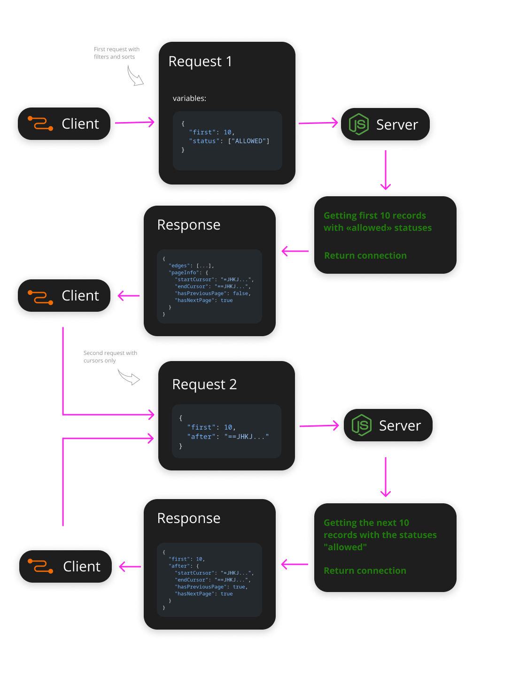

## Connections and cursor pagination

The core contains a set of types, methods and resolvers that will facilitate the creation and handling of connections as described in the [specification](https://relay.dev/graphql/connections.htm). Contains helpers for implementing cursor pagination and legacy pagination by offset/limit.

## Table of contents

 - [Cursor based pagination](#cursor-based-pagination)
 - [Limit/offset pagination](#limit-offset-pagination)


## Cursor based pagination

**Note: you can use our approach or come up with your own. Everything described below is only a recommendation. You have the right to act at your discretion.**

Suppose we need to create an api that can return a list of users. We also need to be able to request a certain number of records, that is, split into pages. We will also need to implement the ability to sort, search and apply filters. The GraphQL specification clearly describes what **first** ,**after**, **last** and **before** are for, but among the documents it is not easy to find information on how to apply various filters to pagination with cursors at the same time.

If you want to use pagination by cursors, then the sequence of actions should be as follows: First you apply some sort of selection filter, sorting, and anything else. You can specify how many elements you want to get, but you can't pass cursors (**after** or **before**) in the first request. When you get the first selection result, you will get access to the cursors. To move back and forth through the pages, you have to pass only two parameters: the cursor (**after** or **before**) and the number of results (**first** or **last**). The thing is that cursor-based pagination assumes that when you move through pages, you cannot change their order and total number. That is why all filters and sorting are applied once at the first request.



According to the graphQL paradigm, first we have to declare the scheme:

SDL will be:

```graphql
type Query {
  list(
    first: Int
    last: Int
    after: String
    before: String
    status: [UserStatus!]
  ): UsersConnection!
}

type User implements Node {
  id: ID!
  name: String!
  status: UserStatus!
  createdAt: DateTime!
  updatedAt: DateTime!
}

enum UserStatus {
  ALLOWED
  FORBIDDEN
}

type UsersConnection implements Connection {
  pageInfo: PageInfo!
  edges: [UserEdge!]!
}

type UserEdge implements Edge {
  node: User!
  cursor: String!
}
```

When you create your own scheme, according to the `SLD` proposed above, you will need to create such types as: **OrderDirection**, **Connection**, **PageInfo**, **Edge**, **Node**, etc. You can use the ready-made graphql scalar types available in the Core (see: [Scalars](./scalars.md)).

As you can see, the field `users` of type `Query` has the following set of arguments:

 - **first** - pagination argument as per GraphQl specification
 - **last** - pagination argument as per GraphQl specification
 - **after** - pagination argument as per GraphQl specification
 - **before** - pagination argument as per GraphQl specification
 - **status** - user criteria by status

Now you can create a schema.

At first we make a `User` type. To create a connection, we must use not just the `User` type, but the type that is implemented from the `Node` interface. To do this, Core has a ready-made interface that can be specified to our `User` type. The **Node** interface is an interface that prescribes to have a required field **id** with the type `GraphQLID`. See code below:

```ts
import {
  GraphQLObjectType,
  GraphQLString,
  GraphQLNonNull,
  GraphQLID,
  GraphQLEnumType,
} from "graphql";
import { NodeInterfaceType } from "@via-profit-services/core";

const UserStatus = new GraphQLEnumType({
  name: "UserStatus",
  values: {
    ALLOWED: { value: "allowed" },
    FORBIDDEN: { value: "forbidden" },
  },
});

const User = new GraphQLObjectType({
  name: "User",
  interfaces: [NodeInterfaceType], // implements by interface Node
  fields: {
    id: { type: new GraphQLNonNull(GraphQLID) },
    name: { type: new GraphQLNonNull(GraphQLString) },
    status: { type: new GraphQLNonNull(UserStatus) },
  },
});

```

Before creating a connection type directly, we first need to create an Edge type. The Edge type must also be implemented from a certain Edge interface, which prescribes having two required fields: the `cursor` and the `node`. To do this, Core has a ready-made interface that can be specified to our `UserEdge` type:

```ts
import { GraphQLObjectType, GraphQLString, GraphQLNonNull} from "graphql";
import { EdgeInterfaceType } from "@via-profit-services/core";

const UserEdge = new GraphQLObjectType({
  name: "UserEdge",
  interfaces: [EdgeInterfaceType], // implements by interface Edge
  fields: () => ({
    cursor: { type: new GraphQLNonNull(GraphQLString) },
    node: { type: new GraphQLNonNull(User) }, // The User type was created in the previous step
  }),
});

```

Now we can start creating the `Connection` type. This type should also be implemented from the interface. In this case it is the interface `Connection`. This interface prescribes us two required fields: `pageInfo` and `edges`. The edges field is an array of `Edge`. And for the `pageInfo` field type, we can use a ready-made type from Core.

```ts
import {
  GraphQLObjectType,
  GraphQLNonNull,
  GraphQLInt,
  GraphQLList,
} from "graphql";
import {
  PageInfoType,
  ConnectionInterfaceType,
} from "@via-profit-services/core";

const UsersConnection = new GraphQLObjectType({
  name: "UsersConnection",
  interfaces: [ConnectionInterfaceType], // implements by interface Connection
  fields: () => ({
    totalCount: { type: new GraphQLNonNull(GraphQLInt) },
    pageInfo: { type: new GraphQLNonNull(PageInfoType) },
    edges: {
      type: new GraphQLNonNull(
        new GraphQLList(
          new GraphQLNonNull(UserEdge) // The UserEdge type was created in the previous step
        )
      ),
    },
  }),
});

```

Now the most difficult thing remains - it is necessary to combine all this into a single scheme and create a resolver. We will create a schema with a single `users` field that will accept some arguments and return us a list of users in the connection format. Let the `users` field accept arguments that allow you to select a certain number of users with the ability to filter the list by the status.

For convenience, we will divide the writing of the code into several parts, but remember that this is the code of the same resolver.

```ts
const Schema = new GraphQLSchema({
  query: new GraphQLObjectType({
    name: "Query", // Required GraphQL field
    fields: () => ({
      users: {
        type: new GraphQLNonNull(UsersConnection), // Return the connection type
        args: {
          first: { type: GraphQLInt },
          last: { type: GraphQLInt },
          after: { type: GraphQLString },
          before: { type: GraphQLString },
          status: { type: new GraphQLList(new GraphQLNonNull(UserStatus)) },
        },
        resolve: async (_parent, args) => {
          const { first, last, before, after } = args;

          if (!first && !last) {
            throw new Error(
              "Missing «first» or «last» argument. You must provide one of the argument"
            );
          }

          if (first && last) {
            throw new Error(
              "Got «first» and «last» arguments. You must provide one of the argument"
            );
          }

          if (last && !before) {
            throw new Error(
              "Missing «before» argument. You must provide cursor value"
            );
          }

          if (typeof first === "number" && first < 0) {
            throw new Error(
              "Argument «first» must be a positive integer value"
            );
          }

          if (typeof last === "number" && last < 0) {
            throw new Error("Argument «last» must be a positive integer value");
          }

          // ... That's not all
        },
      },
    }),
  }),
});

export default Schema;
```

The code written above describes the resolver for our list of users. First of all, we check the correctness of the arguments passed to us, which directly affect the data selection.

The next step is to determine which side of the list of users you want to get a selection from (from the beginning of the list or from the end). The determining factor is the presence or absence of arguments such as `first` and `last`. If we were given the `first` argument, then the fetching should be from the beginning of the list, and if `last`, then from the end. In the previous step, we created a check that will not allow us to pass both the `first` and `last` arguments at the same time.

Now the most interesting thing. We need to follow the rule: First, we are given the number of fetching records and filtering criteria, and the next request is the number of records and the cursor. Obviously, when we receive the cursor, we somehow need to determine by which criteria the next fetching should be carried out. The cursor is a string of any content, which means that we can encode anything into it. Suppose the request contains the following criteria: 

```json
{
  "first": 10,
  "status": ["ALLOWED"]
}
```

According to the arguments passed, we must returns a connection that will contain no more than 10 users with the status «allowed». When building cursors, we can encode selection criteria (`status: ['allowed']`) and the current position in the total sample (`offset: n`) into each of them. We will encode the cursor in Base64 - it's simple and besides, looking at the encoded string, you can easily guess that this is exactly base64 encoding. Now if the cursor and the number of required records are passed to us in the request, we can easily decode it and determine the initial selection criteria (`status: ['allowed']'`).


```ts
const Schema = new GraphQLSchema({
  query: new GraphQLObjectType({
    name: "Query", // Required GraphQL field
    fields: () => ({
      users: {
        type: new GraphQLNonNull(UsersConnection), // Return the connection type
        args: {
          first: { type: GraphQLInt },
          last: { type: GraphQLInt },
          after: { type: GraphQLString },
          before: { type: GraphQLString },
          status: { type: new GraphQLList(new GraphQLNonNull(UserStatus)) },
        },
        resolve: async (_parent, args) => {
          const { first, last, before, after, status } = args;

          // ...
          // Checking of the arguments (see code fragment above)
          // ...

          let limit = 0; // define initial value
          let offset = 0; // define initial value

          // define initial values
          let cursor = {
            offset: 0,
            status,
          };

          // We determine that this is the first request (the cursor is not passed)
          if (first && !after) {
            limit = first;
            offset = 0;
            cursor.offset = 0;
          }

          // We determine that this is the request with passed cursor
          // Fetching from the start of the list (has the «first» argument)
          if (first && after) {

            // Decoding the passed cursor to get the filter criteria
            cursor = JSON.parse(Buffer.from(after, "base64").toString("utf8"));
            limit = first;
            offset = Math.max(cursor.offset, 0) + 1;
            cursor.offset = Math.max(cursor.offset, 0) + 1;
          }

          // We determine that this is the request with passed cursor
          // Fetching from the end of the list (has the «last» argument)
          if (last && before) {

            // Decoding the passed cursor to get the filter criteria
            cursor = JSON.parse(Buffer.from(before, "base64").toString("utf8"));
            limit = last;
            offset = Math.max(cursor.offset - last, 0);
            cursor.offset = Math.max(cursor.offset - last, 0);
          }
        },
      },
    }),
  }),
});

export default Schema;

```


Now we can make a direct selection from the database. For example, we will use the [Knex](https://github.com/knex/knex) ORM and the [PostgreSQL](https://www.postgresql.org) database, but the same applies to any other ORM or even without any ORM.


```ts
const Schema = new GraphQLSchema({
  query: new GraphQLObjectType({
    name: "Query", // Required GraphQL field
    fields: () => ({
      users: {
        type: new GraphQLNonNull(UsersConnection),
        args: {
          first: { type: GraphQLInt },
          last: { type: GraphQLInt },
          after: { type: GraphQLString },
          before: { type: GraphQLString },
          status: { type: new GraphQLList(new GraphQLNonNull(UserStatus)) },
        },
        resolve: async (_parent, args) => {
          const { first, last, before, after, status } = args;

          // ...
          // Checking of the arguments (see code fragment above)
          // ...

          // ...
          // Parsing the cursors (see code fragment above)
          // ...

          // ...
          // Making a new cursors (see code fragment above)
          // ...

          // Make the Database request
          const request = knex
            .select(
              knex.raw(`lag(??) over() as "prev"`, ['users.id']),
              knex.raw(`lead(??) over() as "next"`, ['users.id']),
            )
            .limit(limit) // <-- We have a limit from the first/last argument
            .offset(offset); // <-- We have an offset from the cursor

          if (Array.isArray(status)) {
            request.whereIn('status', request);
          }

          // Apply the request
          const response = await request; // <-- Returns array of records

          // Compile edges
          // Each edge must contain two fields: node and cursor
          const edges = response.map((node, index) => ({
            // Node - is the record (jus record from the database)
            node,

            // encoding the cursor data to Base64 string
            cursor: Buffer.from(
              JSON.stringify({
                ...cursor,
                offset: cursor.offset + index,
              }),
            ).toString('base64'),
          }));

          // We form the Page Info object
          const pageInfo = {
            hasPreviousPage: edges.length ? response[0].prev !== null : false,
            hasNextPage: edges.length ? response[response.length - 1].next !== null : false,
            startCursor: edges.length ? edges[0].cursor : undefined,
            endCursor: edges.length ? edges[edges.length - 1].cursor : undefined,
          };

          // Done
          return {
            pageInfo,
            edges,
          };
        },
      },
    }),
  }),
});
```
So, your GraphQL server can accept requests for sampling **by cursors**, but inside you still have the ability to perform sampling using **limit** and **offset**

GraphQL specification prescribes the use of paginated navigation on cursors, but this is not a requirement, but only a recommendation. If you want, you can use pagination on **limit** and **offset**. If you decide to use [Relay](https://github.com/facebook/relay) on the client side, you need to accept selection requests with pagination on cursors.

