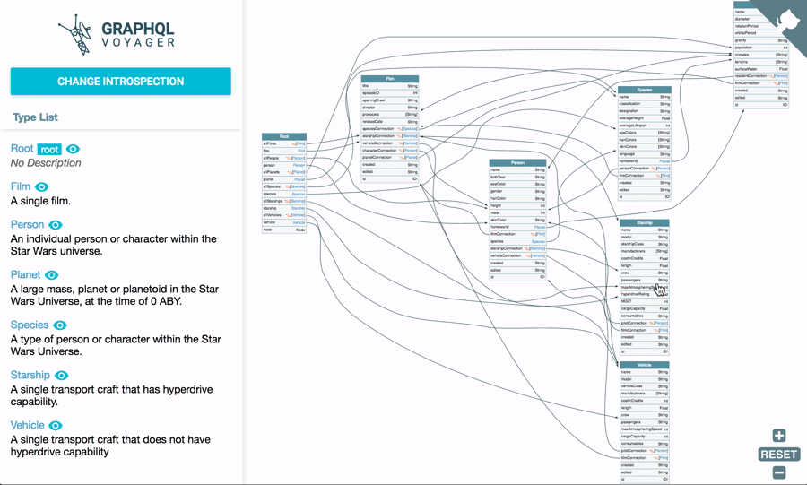

# GraphQL voyager

> С GraphQl-Voyager вы можете визуально изучить API GraphQL в виде интерактивного графика. Это отличный инструмент при разработке или обсуждении вашей модели данных. Он включает несколько примеров схем GraphQL, а также позволяет подключать его к своей конечной точке GraphQL. Чего же вы ждете, изучите свой API!

_[GraphQL Weekly #42](https://graphqlweekly.com/issues/42)_

## [GraphQL voyager](https://github.com/APIs-guru/graphql-voyager)

## [Live Demo](https://apis.guru/graphql-voyager/)

# Особенности интеграции

**GraphQL voyager** интегрирован в проект как Express middleware и по умолчанию всегда доступен в `develoment` режиме.

При запуске **GraphQL voyager** автоматически генерируется и добавляется к заголовкам `AccessToken`. Это необходимо для того, чтобы обойти защиту `src/authentificator/authentificatorMiddleware.ts`, которая блокирует все запросы без валидного токена.